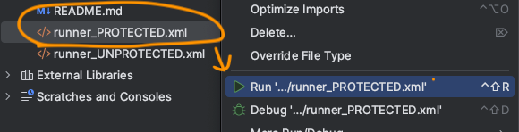
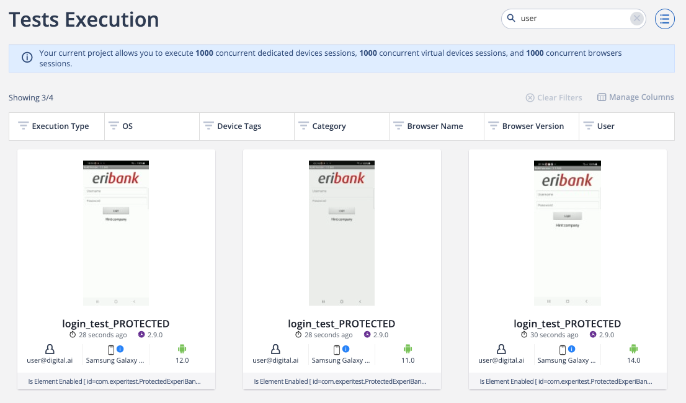
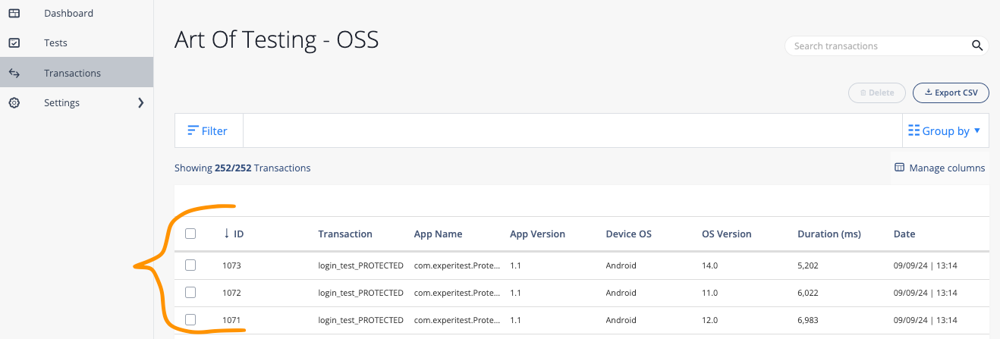
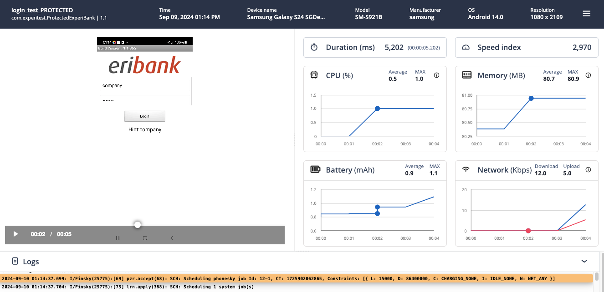

# Continuous Testing & App Sec Integration Tests

This repository is designed to run Performance Tests using Appium against a Native Application with two variants, unprotected and protected.

The end results of running Automated Performance Tests on unprotected vs protected Mobile Application is to showcase how the Device Metrics differ between the two.

For example, when using an unprotected Application, the CPU, Memory or Battery usage may not be as high, but you are now compromising on security where bad actors can do their work.

But if you protect your Application, how much should you protect? At what point do you start seeing Performance degradation on the Mobile Application?

This repository should help to set the base foundation of what Automated Performance Tests should look like.

## Prerequisites

Provide your Cloud URL and Access Key in ```config.properties``` file.

[Obtain your Access Key](https://docs.digital.ai/bundle/TE/page/obtaining_access_key.html)

## Running the Tests

There are two .xml files:

- runner_PROTECTED.xml

- runner_UNPROTECTED.xml


To run a file, Right Click > Run:



On the CT Platform, you should see Tests running under the "Tests Execution" page:



Once the Tests are executed, navigate to the following URL to find the Performance Test Results:

https://<your_cloud_url>/reporter/reporter/transactions



And you can now click on each report to get specific details from a particular Performance Test:

